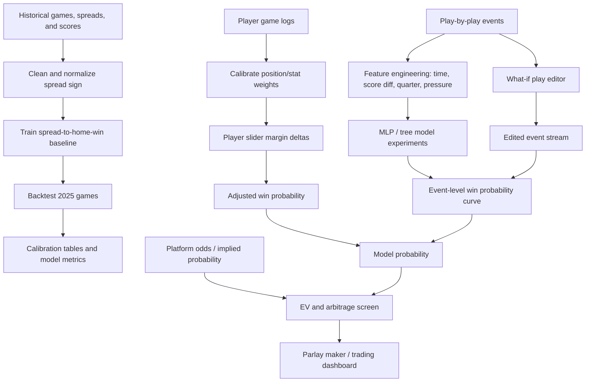

# BSA Basketball Game State Probability Model

This repository contains Bruin Sports Analytics research and prototypes for NBA game-state probability modeling. The broader project has two product tracks:

1. **NBA game-state probability and arbitrage engine** - estimate game and player-prop probabilities from spreads, team/player stats, and play-by-play context, then compare model probabilities against parlay and prediction-market prices to identify expected-value opportunities.
2. **Play-by-play what-if editor** - let a user reinterpret or edit a historical game event, such as changing a missed shot to a make, adding a possession, or revising a scoring outcome, and inspect whether the modeled game outcome or win-probability path changes.

The current `main` branch is the integration baseline. It includes the V1 spread/player-slider model and a React parlay-maker prototype, while several feature branches hold more specialized modeling, what-if, data, design, and packaging work.

## Current Main Branch

- `win-prob-baseline-v1/` implements a first-pass win probability model:
  - spread-to-home-win logistic baseline trained on 2024 regular season games;
  - 2025 chronological rolling backtest;
  - calibrated player-slider layer for points, rebounds, and assists;
  - position/stat weights and sensitivity indicators for player adjustments;
  - Streamlit and Tkinter slider prototypes.
- `parlay-maker/` is a Vite + React + TypeScript prototype for filtering NBA games, selecting player prop legs, and building a parlay slip from mock data.

Important V1 backtest artifacts are checked into `win-prob-baseline-v1/outputs/`. The latest main-branch summary reports 1,230 backtest games, log loss `0.5818`, Brier score `0.1993`, accuracy at 0.5 of `0.6943`, high-confidence hit rate `0.7250`, and mean absolute calibration gap `0.0363`.

## Branch Inventory

| Branch | Purpose |
| --- | --- |
| `main` | Integration baseline with V1 model artifacts and the parlay-maker frontend prototype. |
| `feature/win-prob-baseline-v1` | Source branch for the baseline spread model, calibrated player adjustments, backtests, and generated outputs now merged into `main`. |
| `feature/win-prob-v2-new-things` / `origin/feature/win-prob-v2-new-things` | Adds V2 modeling notes, expanded player/team slider math, a standalone HTML model demo, and a dark sports-trading UI. The local branch is behind `origin` by two commits. |
| `pbp` / `origin/pbp` | Play-by-play modeling work with historical play-by-play data, MLP experiments, XGBoost/Random Forest experiments, and saved model artifacts (`wp_model_feature_pipeline.joblib`, `wp_model_mlp.pt`). |
| `portable-bundle` / `origin/portable-bundle` | Clean portable bundle that separates a Python NBA data/EDA pipeline from a Vite React TypeScript calculator frontend. |
| `web-dev` / `origin/web-dev` | NBA What If frontend/backend prototype: React/Vite UI, Recharts, Flask API, NBA CDN/API client, static public game JSON files, and `vercel.json`. |
| `origin/final-design-v1` | UI/design iteration on top of `main`, including profile-photo assets and HTML model-demo updates. |
| `origin/vikram-what-if-branch` | Alternate what-if/model iteration on top of early parlay-maker work, including modified player-adjustment logic and HTML demo updates. |

## Tech Stack

- **Frontend:** Node.js, npm, Vite, React, TypeScript in `parlay-maker/` and `portable-bundle/frontend`; React JavaScript in `web-dev`.
- **UI/data visualization:** Recharts in the what-if and trading dashboards; Tailwind CSS, Radix UI primitives, lucide-react, MUI, and motion in the V2 trading UI branch.
- **Modeling and data science:** Python, pandas, NumPy, scikit-learn, PyYAML, nba_api, matplotlib, seaborn, Streamlit, PyTorch, XGBoost, Random Forest notebooks, and joblib model pipelines.
- **Backend/API prototype:** Flask and flask-cors in `web-dev/server` and serverless-style API entrypoint in `web-dev/api/index.py`.
- **Deployment target:** Vercel for frontend builds and API rewrites. The `web-dev` branch includes a `vercel.json` with `npm run build`, `dist` output, `/api/*` rewrites to `api/index.py`, and SPA fallback rewrites to `index.html`.

## Repository Structure

Current `main` layout:

```text
.
+-- README.md
+-- parlay-maker/
|   +-- package.json
|   +-- vite.config.ts
|   +-- public/
|   +-- src/
|       +-- App.tsx
|       +-- components/
|       |   +-- GameFilter.tsx
|       |   +-- ParlaySlip.tsx
|       |   +-- PlayerCard.tsx
|       +-- data.ts
|       +-- types.ts
|       +-- utils.ts
+-- win-prob-baseline-v1/
    +-- README.md
    +-- requirements.txt
    +-- run_v1.py
    +-- configs/
    |   +-- position_weights.yaml
    +-- data/
    |   +-- player_game_logs_2023-24.csv
    +-- outputs/
    |   +-- baseline_params.json
    |   +-- position_stat_weights.json
    |   +-- backtest_2025_*.csv/json
    |   +-- player_slider_scenario_checks.csv
    +-- src/
    |   +-- baseline.py
    |   +-- backtest.py
    |   +-- calibration.py
    |   +-- data_loader.py
    |   +-- player_adjustment.py
    |   +-- win_prob_indicators.py
    +-- tools/
        +-- matchup_slider_streamlit.py
        +-- matchup_slider_tk.py
```

Branch-only layouts that are relevant to future integration:

```text
web-dev/
+-- api/index.py
+-- server/
|   +-- app.py
|   +-- nba_client.py
|   +-- win_probability.py
|   +-- requirements.txt
+-- public/data/games-2015.json ... games-2024.json
+-- scripts/processData.js
+-- src/components/PlayEditor.jsx
+-- vercel.json

portable-bundle/
+-- pipeline/data_pipeline.py
+-- frontend/src/
    +-- components/WinProbabilityCalculator.tsx
    +-- config/modelConfig.ts
    +-- utils/winProbability.ts

pbp/
+-- data/
|   +-- 2021-22/ ... 2025-26/
|   +-- pbp_all.csv
|   +-- data_needs.md
+-- mlp_final.ipynb
+-- mlp_experiments.ipynb
+-- xgboost_rf_model.ipynb
+-- wp_model_feature_pipeline.joblib
+-- wp_model_mlp.pt
```

## Model Scope

### V1 Spread Baseline

The baseline model normalizes the betting spread into home-team perspective and fits:

```text
P(home win) = sigmoid(intercept + spread_coef * signed_spread_home)
```

The model is trained on 2024 regular season games and evaluated on 2025 regular season games using rolling retraining windows. A normal-CDF rule is also present as an interpretable comparison path.

### Player Slider Layer

The player-adjustment layer converts counterfactual changes in player `PTS`, `REB`, and `AST` into an adjusted margin, then maps that adjusted margin back to win probability through the baseline logistic function.

- Points use calibrated position/stat coefficients.
- Rebounds are decomposed into offensive and defensive value with position priors. Offensive rebounds are treated as second-chance point creation, while defensive rebounds are partially discounted to account for teammate reallocation.
- Assists use a four-outcome categorical model: assisted 2P, assisted 2P plus free throw, assisted 3P, and assisted 3P plus free throw. The model estimates expected points per assist and a playmaking premium.
- Sensitivity indicators chain player stat -> team margin -> win probability, producing the green/red slider feedback documented in the V2 HTML model notes.

### Team Stat Slider Extensions

The V2 HTML notes outline top-down team sliders for `PTS`, `REB`, `AST`, `TOV`, `FG%`, `3PT%`, and `FT%`. The intended behavior is to update the team margin and win probability, then allocate implied changes back to players through proportional, usage-weighted, role-based, or constrained allocation schemes. This is currently branch/demo-level work, not fully integrated into `main`.

### Play-by-Play Modeling

The `pbp` branch moves toward a possession/event-level model using historical play-by-play data from 2021-22 through 2025-26. Experiments include:

- MLP pipeline with sklearn one-hot encoding and PyTorch model weights;
- train/validation/test split by season: 2021-22 through 2023-24 train, 2024-25 validation, 2025-26 test;
- numeric features such as period time remaining, game seconds left, score differential, and score-time pressure;
- categorical quarter encoding;
- XGBoost and Random Forest comparison notebooks with feature-importance analysis.

## Product Components

### Arbitrage and Parlay Interface

The arbitrage workflow compares model probabilities to platform-implied probabilities. The current `parlay-maker` app is a mock-data prototype for:

- filtering games;
- browsing player props;
- adjusting prop legs;
- adding/removing legs from a parlay slip;
- computing basic parlay slip state.

The V2 trading UI branch extends this concept with market cards, expected value, confidence, liquidity, slippage, sharp/public money labels, line movement, Kelly sizing, and portfolio views. These fields are currently mocked and should be wired to model outputs and market data before production use.

### Play-by-Play What-If Editor

The `web-dev` branch implements the what-if editor direction:

- select season and season type;
- select a completed game;
- fetch play-by-play and box score data through Flask/NBA API wrappers;
- display original win probability and recomputed what-if curves side by side;
- edit scoring outcomes for shots and free throws;
- add a new play with team, player, event type, result, and insertion point;
- reset changed scenarios.

The current win probability formula in this branch is an interpretable logistic function over score differential and time remaining. It should eventually be replaced or calibrated against the richer event-level model from the `pbp` branch.

## Data Pipeline



## Running Locally

### Baseline Model

From the repository root:

```bash
python3 -m venv .venv
source .venv/bin/activate
pip install -r win-prob-baseline-v1/requirements.txt
python win-prob-baseline-v1/run_v1.py
```

The script writes model parameters, backtest metrics, calibration tables, and player-slider checks into `win-prob-baseline-v1/outputs/`.

### Parlay Maker

```bash
cd parlay-maker
npm install
npm run dev
```

For a production build:

```bash
cd parlay-maker
npm run build
```

### What-If Prototype

This code currently lives on `web-dev`:

```bash
git switch web-dev
npm install
npm run dev
```

For the Flask API:

```bash
cd server
python3 -m venv .venv
source .venv/bin/activate
pip install -r requirements.txt
python3 -m server.app
```

The server runs at `http://localhost:5001`, while Vite proxies `/api/*` during development.

## Deployment

The intended deployment target is Vercel:

- Frontend: Vite build command `npm run build`, output directory `dist`.
- API: Python serverless-style entrypoint in `api/index.py` for `/api/*` routes.
- SPA fallback: route all non-API paths to `index.html`.

The deployable `vercel.json` currently exists on the `web-dev` branch. If `parlay-maker`, the V2 trading dashboard, and the what-if editor are merged into a single app, the Vercel config should be promoted to `main` and updated for the final directory structure.

## Known Limitations

- The arbitrage and parlay UIs currently rely on mock player, game, and market data.
- The V1 model is spread-driven and should not be treated as a full in-game possession model.
- Player sliders are counterfactual scenario tools, not forecasts of player distributions.
- Assist and points sliders can double count scoring value when both are moved together; `redistribute_assist_points()` is the primitive for resolving this before user-facing claims.
- Rebound and assist constants use informed priors and partial calibration; they need larger-sample validation.
- The what-if editor's current win probability curve is a simple logistic score/time heuristic.
- `nba_api`, `stats.nba.com`, and NBA CDN calls can be rate-limited or blocked on some networks.
- Some branches include generated dependency folders such as `node_modules`; these should not be promoted into `main`.
- No production market-data ingestion, authentication, persistence, risk controls, or compliance checks are implemented.

## Future Work

- Merge the `web-dev` what-if editor into `main` behind a clean app route.
- Promote the Vercel deployment config after the final frontend/API layout is settled.
- Replace mock arbitrage inputs with real odds, implied probabilities, liquidity, and timestamped line movement.
- Calibrate the event-level model against historical play-by-play and compare against external benchmarks such as ESPN win probability.
- Build rolling team-form features from game-by-game stats using only information available before each game.
- Add lineup and on-court-player context for possession-level modeling.
- Convert notebooks into reproducible training scripts with pinned dependencies and saved evaluation reports.
- Add automated tests for spread normalization, probability calibration, slider math, what-if recomputation, and API contracts.
- Resolve assist/points double counting and define a single source of truth for player-to-team stat allocation.
- Add model governance: versioned artifacts, experiment tracking, monitoring, and clear research/production boundaries.

## Contributors

BSA Basketball Research: Harsh Govindji, Moulik Chatterjee, Raja Kavasseri, Sampath Kalagarla, Vikram Subramanian, Danny Lenny, Josh Rusit, and Michael Pham


## Notes for Maintainers

- Keep `main` as the documented integration branch.
- Before merging branch work, remove generated dependency folders and rebuild lockfiles from source.
- Prefer checked-in scripts and reproducible artifacts over notebook-only workflows.
- Update this README whenever branch-only functionality is merged into `main`.
